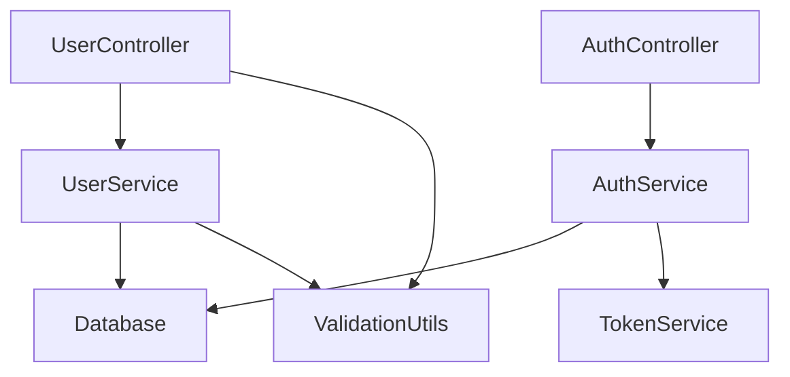
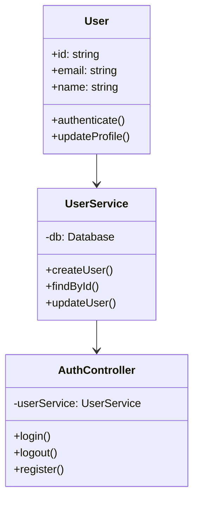
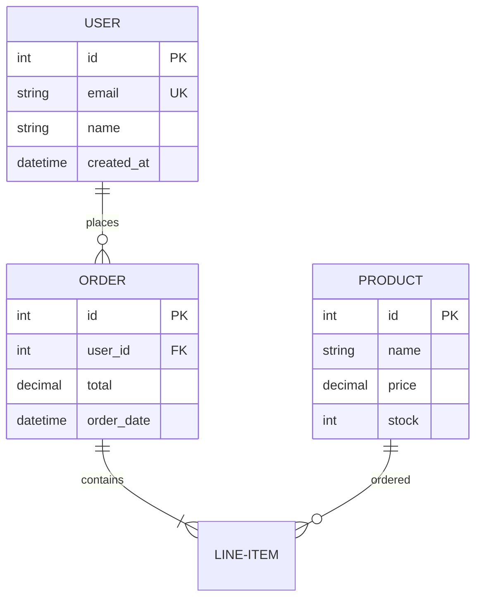
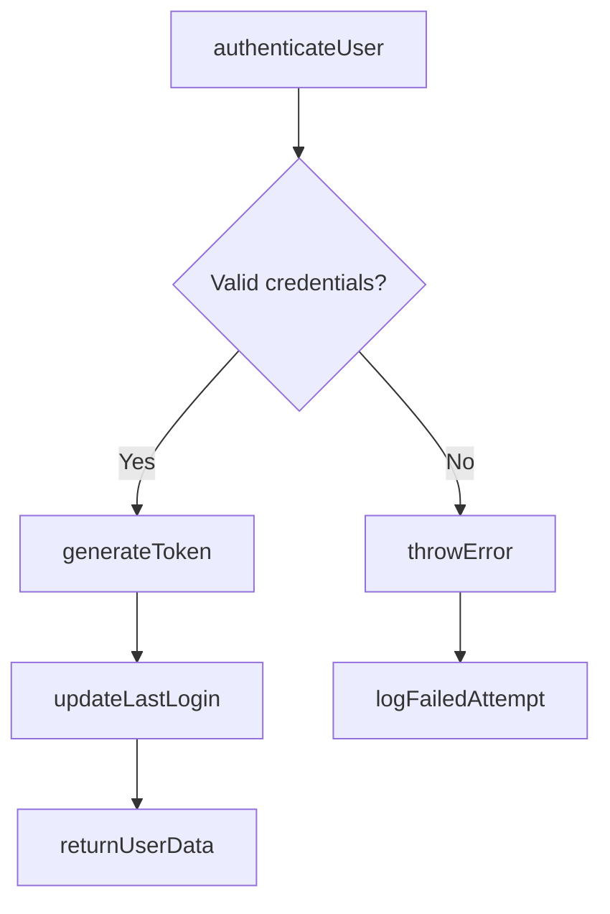

# 🚀 ScribeVerse

<div align="center">


**AI-Powered Documentation Generation with Visual Diagrams & VS Code Integration**

[🚀 Quick Start](#-quick-start) • [📚 Features](#-features) • [🔧 Installation](#-installation) • [📖 Documentation](https://github.com/jatin2507/scribeverse/blob/main/docs/README.md) • [🤝 Contributing](https://github.com/jatin2507/scribeverse/blob/main/CONTRIBUTING.md)

</div>

---

## 🎯 What is ScribeVerse?

ScribeVerse automatically analyzes your codebase and generates comprehensive documentation using advanced AI models. It understands your code structure, creates visual diagrams, and produces human-readable docs that stay in sync with your development workflow.

### ✨ Core Capabilities

- **🤖 AI-Powered Analysis** - Understands code context and relationships
- **📦 Automatic Dependencies** - Installs AI provider SDKs automatically as needed
- **📊 Visual Documentation** - Generates actual diagram images, not just text
- **🔌 VS Code Integration** - Works directly with VS Code Language Model API
- **🛡️ Bulletproof Reliability** - Multiple fallback systems ensure 100% success
- **🌐 Multi-Language Support** - TypeScript, Python, SQL, and more
- **⚡ Smart Automation** - Incremental updates and intelligent processing

---

## 🔧 Installation

### Global Installation
```bash
npm install -g scribeverse
```

### Project-Specific Installation
```bash
npm install --save-dev scribeverse
```

### System Requirements
- Node.js 18.0.0 or higher
- Git (optional, for smart commit features)

---

## 🚀 Quick Start

### 1. Initialize Your Project
```bash
scribeverse init
```
This creates a `scribeverse.config.json` with intelligent defaults.

### 2. Configure AI Provider (Choose One)

**Option A: VS Code Language Model (No API Key Needed)**
```json
{
  "ai": {
    "provider": "vscode-lm",
    "model": "auto"
  }
}
```

**Option B: OpenAI**
```json
{
  "ai": {
    "provider": "openai",
    "model": "gpt-4o-mini",
    "apiKey": "sk-..."
  }
}
```

**Option C: Anthropic Claude**
```json
{
  "ai": {
    "provider": "anthropic",
    "model": "claude-3-5-sonnet",
    "apiKey": "sk-ant-..."
  }
}
```

### 3. Generate Documentation
```bash
# Basic generation
scribeverse generate

# With custom output directory
scribeverse generate --output ./documentation

# With visual diagrams
scribeverse generate --diagrams
```

---

## 📚 Complete Features Overview

### 🔌 VS Code Language Model Integration
**Seamless integration with VS Code Language Model API**

ScribeVerse integrates directly with VS Code's Language Model API, allowing you to use AI models through VS Code without managing API keys.

```bash
# Generate docs using VS Code LM API
scribeverse generate --provider vscode-lm

# Initialize with VS Code LM integration
scribeverse init --provider vscode-lm
```

**Configuration Example:**
```json
{
  "ai": {
    "provider": "vscode-lm",
    "model": "auto"
  }
}
```

**Benefits:**
- ✅ No API key management required
- ✅ Uses VS Code's built-in AI capabilities
- ✅ Simple configuration
- ✅ Automatic model selection

### 🎨 Visual Diagram Generation
**Generate actual images and interactive diagrams, not just text**

ScribeVerse creates professional visual diagrams using Mermaid CLI and Puppeteer, generating actual PNG/SVG files and interactive HTML versions.

```bash
# Generate all diagram types
scribeverse generate --diagrams

# Generate specific diagram types
scribeverse generate --diagrams=project-structure,dependencies,class-diagrams

# Custom diagram configuration
scribeverse generate --diagrams --diagram-format=svg --diagram-theme=dark
```

**Available Diagram Types:**

#### 🏗️ Project Structure Diagrams
Visual representation of your project's file and folder hierarchy:
```
📁 MyProject
├── 📁 src
│   ├── 📄 index.ts (Entry point)
│   ├── 📁 components
│   │   ├── 📄 Button.tsx (React component)
│   │   └── 📄 Modal.tsx (Dialog component)
│   ├── 📁 services
│   │   ├── 📄 UserService.ts (User management)
│   │   └── 📄 ApiService.ts (HTTP client)
│   └── 📁 utils
│       ├── 📄 helpers.ts (Utility functions)
│       └── 📄 validators.ts (Input validation)
├── 📁 tests
└── 📄 package.json
```

#### 🔗 Module Dependency Graphs
Interactive diagrams showing how modules connect:


#### 📊 Class Diagrams (UML-Style)
Object-oriented structure visualization:


#### 🗄️ Database ER Diagrams
Entity relationship diagrams for SQL files:


#### 🔄 Function Flow Charts
Code execution flow visualization:


**Diagram Configuration:**
```json
{
  "diagrams": {
    "enabled": true,
    "format": "png",                // png, svg, html
    "theme": "default",             // default, dark, forest, neutral
    "interactive": true,            // Generate HTML versions
    "backgroundColor": "#ffffff",
    "width": 1200,
    "height": 800,
    "types": [
      "project-structure",
      "dependency-graph",
      "class-diagram",
      "database-er",
      "function-flow"
    ]
  }
}
```

**Generated Output:**
```
docs/diagrams/
├── project-structure.png           # Static image
├── project-structure.html          # Interactive version
├── dependency-graph.svg            # Vector graphics
├── dependency-graph.html           # Zoomable version
├── user-service-class.png          # Class diagram
├── database-schema.png             # ER diagram
└── auth-flow-chart.png            # Function flow
```

### 🧠 Comprehensive AI Provider Ecosystem
**8 AI providers with 60+ models - choose what works best for your project**

ScribeVerse supports the largest variety of AI providers, from cloud-based to local, free to premium.

#### **OpenAI Integration**
```json
{
  "ai": {
    "provider": "openai",
    "model": "gpt-4o-mini",
    "apiKey": "${OPENAI_API_KEY}",
    "maxTokens": 4000,
    "temperature": 0.2
  }
}
```

**Best For:** Fast documentation generation, API references, general-purpose docs

#### **Anthropic Claude Integration**
```json
{
  "ai": {
    "provider": "anthropic",
    "model": "claude-3-5-sonnet-20241022",
    "apiKey": "${ANTHROPIC_API_KEY}",
    "maxTokens": 4000
  }
}
```

**Best For:** Large codebases, detailed architecture analysis, complex reasoning

#### **Google Gemini Integration**
```json
{
  "ai": {
    "provider": "google-gemini",
    "model": "gemini-2.0-flash",
    "apiKey": "${GOOGLE_GEMINI_API_KEY}"
  }
}
```

**Available Models:**
- `gemini-2.0-flash` - Latest, fastest model
- `gemini-1.5-pro` - Higher quality for complex analysis
- `gemini-1.5-flash` - Balanced speed and cost

**Best For:** Free tier usage, multimodal content, cost-effective documentation

#### **VS Code Language Model Integration**
```json
{
  "ai": {
    "provider": "vscode-lm",
    "model": "auto"
  }
}
```

**Best For:** No API key setup, VS Code users, simple configuration

#### **xAI Grok Integration**
```json
{
  "ai": {
    "provider": "xai-grok",
    "model": "grok-4",
    "apiKey": "${XAI_API_KEY}",
    "enableSearch": true
  }
}
```

**Best For:** Real-time information, reasoning tasks, up-to-date documentation

#### **Ollama (Local) Integration**
```json
{
  "ai": {
    "provider": "ollama",
    "model": "llama3.1:8b",
    "baseURL": "http://localhost:11434"
  }
}
```

**Best For:** Privacy-focused projects, offline usage, no API costs

#### **LiteLLM Proxy Integration**
```json
{
  "ai": {
    "provider": "litellm",
    "model": "openai/gpt-4o-mini",
    "baseURL": "http://localhost:4000"
  }
}
```

**Best For:** Multi-provider management, cost optimization, experimentation

### 📊 Intelligent Documentation Structure
**Automatically organized documentation with deep cross-linking**

ScribeVerse doesn't just generate random documentation - it intelligently organizes your codebase into logical groups and creates comprehensive cross-references.

#### **Smart Module Grouping**
ScribeVerse automatically groups related modules:

```
docs/
├── overview.md                     # 🏠 Project navigation hub
├── groups/                         # 📁 Intelligent module groups
│   ├── api-routes.md              # 🌐 API endpoints & controllers
│   │   ├── UserController.ts      # User management endpoints
│   │   ├── AuthController.ts      # Authentication routes
│   │   └── ProductController.ts   # Product management API
│   ├── core-system.md             # ⚡ Business logic & services
│   │   ├── UserService.ts         # User business logic
│   │   ├── PaymentService.ts      # Payment processing
│   │   └── EmailService.ts        # Email notifications
│   ├── utilities.md               # 🔧 Helper functions & utils
│   │   ├── validators.ts          # Input validation
│   │   ├── formatters.ts          # Data formatting
│   │   └── constants.ts           # Application constants
│   ├── database.md                # 🗄️ Data models & schemas
│   │   ├── User.model.ts          # User entity
│   │   ├── Product.model.ts       # Product entity
│   │   └── migrations/            # Database migrations
│   └── configuration.md           # ⚙️ Config files & settings
├── modules/                        # 📄 Individual module docs
│   ├── user-service.md            # Detailed UserService docs
│   ├── auth-controller.md         # AuthController deep dive
│   └── payment-service.md         # Payment logic documentation
├── diagrams/                       # 📊 Visual documentation
│   ├── project-structure.png      # Project hierarchy
│   ├── project-structure.html     # Interactive version
│   ├── dependency-graph.svg       # Module dependencies
│   ├── api-flow-diagram.png       # API request flows
│   └── database-er-diagram.svg    # Database relationships
└── cross-references.md            # 🔗 Complete navigation index
```

#### **Cross-Reference Generation**
Automatic linking between related modules:

```markdown
# UserService Documentation

## Related Components
- **Controllers**: [UserController](./modules/user-controller.md) - Handles HTTP requests
- **Models**: [User Model](./modules/user-model.md) - Data structure definition
- **Utils**: [User Validators](./modules/user-validators.md) - Input validation
- **Services**: [EmailService](./modules/email-service.md) - User notifications

## Dependencies
This service depends on:
- [Database Connection](./modules/database.md#connection) - Data persistence
- [Authentication Service](./modules/auth-service.md) - User verification
- [Logging Utils](./modules/logger.md) - Error tracking

## Used By
This service is used by:
- [UserController](./modules/user-controller.md#user-service-integration)
- [AdminController](./modules/admin-controller.md#user-management)
- [ReportService](./modules/report-service.md#user-analytics)
```

#### **Navigation Index Generation**
Complete cross-reference index:

```markdown
# 🔗 Cross-Reference Index

## API Endpoints → Services
- `GET /users` → [UserService.findAll()](./modules/user-service.md#findall)
- `POST /users` → [UserService.create()](./modules/user-service.md#create)
- `PUT /users/:id` → [UserService.update()](./modules/user-service.md#update)

## Services → Models
- [UserService](./modules/user-service.md) → [User Model](./modules/user-model.md)
- [PaymentService](./modules/payment-service.md) → [Payment Model](./modules/payment-model.md)

## Utilities Used By
- [validateEmail()](./modules/validators.md#validateemail) used in:
  - [UserController](./modules/user-controller.md#registration)
  - [AuthService](./modules/auth-service.md#login)
  - [ProfileService](./modules/profile-service.md#update)
```

### 🛡️ Bulletproof Reliability System
**100% success guarantee with 8-layer fallback system**

ScribeVerse ensures you ALWAYS get documentation, even when everything goes wrong.

#### **8-Layer Fallback System:**

1. **Primary AI Provider** - Your configured main provider
2. **Secondary AI Providers** - Configured fallback providers
3. **VS Code Extensions** - Use local VS Code AI if available
4. **Static Code Analysis** - Parse code without AI
5. **Basic AST Generation** - Create structure diagrams from code
6. **Emergency Documentation** - Minimal docs with file listings
7. **File System Analysis** - Basic project structure
8. **Absolute Emergency** - Text file with error info and next steps

```bash
# Even with no internet, no API keys, no AI - you get docs
scribeverse generate

# Multiple retry configuration
scribeverse generate --retries 5 --retry-delay 2000

# Force emergency mode (for testing)
scribeverse generate --emergency-fallback
```

#### **Fallback Configuration:**
```json
{
  "ai": {
    "providers": [
      { "provider": "openai", "model": "gpt-4o-mini" },
      { "provider": "anthropic", "model": "claude-3-5-sonnet-20241022" },
      { "provider": "vscode-lm" },
      { "provider": "ollama", "model": "llama3.1:8b" }
    ],
    "primaryProvider": "openai",
    "fallbackProviders": ["anthropic", "vscode-lm", "ollama"],
    "enableFallback": true,
    "maxRetries": 3,
    "retryDelay": 1000,
    "emergencyFallback": true
  }
}
```

#### **Error Recovery Examples:**

**API Failure Recovery:**
```bash
⚠️  OpenAI API failed (503 Service Unavailable)
🔄 Falling back to Anthropic Claude...
⚠️  Anthropic API failed (Rate limit exceeded)
🔄 Falling back to VS Code Language Model...
✅ Using VS Code LM API
📚 Generating documentation with VS Code...
```

**Complete AI Failure Recovery:**
```bash
❌ All AI providers failed
🔄 Switching to static code analysis...
✅ Parsing TypeScript files with AST
✅ Generating basic documentation structure
✅ Creating fallback API reference
📁 Generated 12 documentation files using static analysis
```

**Emergency Mode:**
```bash
💥 Critical failure in documentation generation
🚨 Creating emergency documentation...
✅ EMERGENCY_README.md created with:
   - Project file listing
   - Basic statistics
   - Error details
   - Recovery instructions
   - Contact information
```

### 🌐 Advanced Multi-Language Support
**Parse and document multiple programming languages with deep analysis**

ScribeVerse provides comprehensive support for multiple programming languages with language-specific parsing and documentation generation.

#### **TypeScript/JavaScript Support**
Full Abstract Syntax Tree (AST) parsing with dependency analysis:

```bash
# Parse TypeScript with full analysis
scribeverse generate --include "**/*.{ts,tsx}" --language-features typescript

# Include type definitions
scribeverse generate --include-types --include "**/*.d.ts"
```

**Extracted Information:**
- ✅ Functions with parameters, return types, JSDoc comments
- ✅ Classes with methods, properties, inheritance chains
- ✅ Interfaces and type definitions
- ✅ Import/export relationships
- ✅ Decorators and metadata
- ✅ Generic type parameters
- ✅ Async/await patterns
- ✅ React components and props
- ✅ Node.js modules and dependencies

**Example Output:**
```markdown
## AuthService Class

### Methods

#### `authenticateUser(credentials: LoginCredentials): Promise<AuthResult>`
**Purpose:** Authenticates a user with email and password
**Parameters:**
- `credentials: LoginCredentials` - User login information
  - `email: string` - User's email address
  - `password: string` - User's password
**Returns:** `Promise<AuthResult>` - Authentication result with user data or error
**Throws:** `AuthenticationError` - When credentials are invalid

**Dependencies:**
- [UserService](./user-service.md#findbyemail) - User lookup
- [PasswordUtils](./password-utils.md#verify) - Password verification
- [TokenService](./token-service.md#generate) - JWT generation
```

#### **Python Support**
Comprehensive Python code analysis:

```bash
# Parse Python with full analysis
scribeverse generate --include "**/*.py" --language-features python

# Include docstrings and type hints
scribeverse generate --python-docstrings --python-type-hints
```

**Extracted Information:**
- ✅ Functions with docstrings, type hints, decorators
- ✅ Classes with methods, properties, inheritance
- ✅ Modules and packages structure
- ✅ Import statements and dependencies
- ✅ Exception handling patterns
- ✅ Async/await functions
- ✅ Context managers
- ✅ Generator functions
- ✅ Property decorators

**Example Output:**
```markdown
## UserService Class

### Methods

#### `create_user(user_data: UserCreateInput) -> UserModel`
```python
def create_user(self, user_data: UserCreateInput) -> UserModel:
    """
    Creates a new user account with validation.

    Args:
        user_data (UserCreateInput): User registration data
            - email (str): Valid email address
            - password (str): Password (min 8 characters)
            - name (str): Full name

    Returns:
        UserModel: Created user instance with generated ID

    Raises:
        ValidationError: When user data is invalid
        DuplicateEmailError: When email already exists

    Example:
        >>> service = UserService()
        >>> user = service.create_user({
        ...     "email": "john@example.com",
        ...     "password": "secure123",
        ...     "name": "John Doe"
        ... })
    """
```
```

#### **SQL Support**
Database schema analysis with relationship mapping:

```bash
# Parse SQL with relationship analysis
scribeverse generate --include "**/*.sql" --sql-relationships

# Include migration files
scribeverse generate --include "**/migrations/*.sql"
```

**Extracted Information:**
- ✅ Table definitions with columns and constraints
- ✅ Foreign key relationships
- ✅ Indexes and performance optimizations
- ✅ Views and stored procedures
- ✅ Triggers and database functions
- ✅ Migration scripts and version history
- ✅ Data types and constraints
- ✅ Composite keys and unique constraints

**Example Output:**
```markdown
## Database Schema: E-commerce System

### Tables

#### `users` table
```sql
CREATE TABLE users (
    id SERIAL PRIMARY KEY,
    email VARCHAR(255) UNIQUE NOT NULL,
    password_hash VARCHAR(255) NOT NULL,
    name VARCHAR(100) NOT NULL,
    created_at TIMESTAMP DEFAULT CURRENT_TIMESTAMP,
    updated_at TIMESTAMP DEFAULT CURRENT_TIMESTAMP
);
```

**Relationships:**
- One-to-Many with `orders` (users.id → orders.user_id)
- One-to-Many with `user_sessions` (users.id → user_sessions.user_id)

**Indexes:**
- Primary key: `users_pkey` on `id`
- Unique index: `users_email_key` on `email`
- Performance index: `idx_users_created_at` on `created_at`
```

### ⚡ Smart Automation & Workflow Features
**Intelligent processing with advanced automation capabilities**

ScribeVerse includes sophisticated automation features that make documentation generation seamless and intelligent.

#### **Incremental Documentation Updates**
Only processes files that have changed since last generation:

```bash
# Process only changed files
scribeverse generate --incremental

# Watch for file changes during development
scribeverse generate --watch

# Check what files would be processed
scribeverse generate --dry-run --incremental
```

**How It Works:**
- ✅ Tracks file modification timestamps
- ✅ Maintains checksums of file contents
- ✅ Stores metadata in `.scribeverse/cache/`
- ✅ Skips unchanged files automatically
- ✅ Updates only affected documentation sections

#### **Smart Git Integration**
Auto-generate meaningful commit messages and manage documentation versions:

```bash
# Auto-stage and commit documentation changes
scribeverse smart-commit

# Generate commit message based on changes
scribeverse smart-commit --auto-message

# Stage, commit, and push in one command
scribeverse smart-commit --add-all --push

# Custom commit message with AI enhancement
scribeverse smart-commit --message "Update user authentication docs" --enhance
```

**Generated Commit Messages:**
```
📚 docs: Update authentication flow documentation

- Add comprehensive UserService API documentation
- Update login/logout endpoint specifications
- Add password reset flow diagrams
- Include error handling examples
- Cross-reference security middleware

Generated for: src/auth/UserService.ts, src/auth/AuthController.ts
Affected docs: docs/api/auth.md, docs/diagrams/auth-flow.png
```

#### **Advanced Token Usage Tracking**
Monitor and optimize AI provider costs:

```bash
# Track current session usage
scribeverse usage

# Estimate costs before generation
scribeverse usage --estimate --model gpt-4o-mini

# Generate cost report
scribeverse usage --report --timeframe 30days

# Set usage limits
scribeverse generate --max-tokens 50000 --stop-on-limit
```

**Usage Report Example:**
```
📊 ScribeVerse Usage Report (Last 30 Days)

🤖 AI Provider Usage:
┌─────────────┬─────────────┬───────────┬─────────────┐
│ Provider    │ Tokens Used │ Requests  │ Est. Cost   │
├─────────────┼─────────────┼───────────┼─────────────┤
│ OpenAI      │ 45,230      │ 23        │ $0.91       │
│ Anthropic   │ 12,450      │ 8         │ $0.62       │
│ VS Code     │ 8,900       │ 12        │ $0.00       │
│ Total       │ 66,580      │ 43        │ $1.53       │
└─────────────┴─────────────┴───────────┴─────────────┘

📈 Most Active Projects:
1. my-web-app (28,450 tokens, $0.87)
2. api-service (21,330 tokens, $0.45)
3. mobile-app (16,800 tokens, $0.21)

💡 Cost Optimization Suggestions:
- Switch to gpt-4o-mini for 40% cost reduction
- Use VS Code integration for free processing
- Enable incremental updates to reduce token usage
```

#### **Real-time File Writing**
Files are written immediately as they're generated:

```bash
# See files being created in real-time
scribeverse generate --verbose

# Write files with progress indication
scribeverse generate --show-progress
```

**Real-time Output:**
```
🚀 ScribeVerse v1.1.8 - Starting documentation generation...

📊 Project Analysis:
✅ Found 45 TypeScript files
✅ Found 12 Python files
✅ Found 8 SQL files
✅ Estimated processing time: 3-5 minutes

🤖 AI Provider: OpenAI GPT-4o-mini
📁 Output Directory: ./docs

🔄 Processing files:
✅ README.md written                           [1/8]
✅ docs/overview.md written                    [2/8]
✅ docs/architecture.md written               [3/8]
🔄 Generating API documentation...
✅ docs/api/user-service.md written           [4/8]
✅ docs/api/auth-controller.md written        [5/8]
🔄 Creating visual diagrams...
✅ docs/diagrams/project-structure.png written [6/8]
✅ docs/diagrams/dependency-graph.svg written  [7/8]
✅ docs/cross-references.md written            [8/8]

🎉 Documentation generation completed successfully!
📁 Generated 8 files in ./docs (3.2MB total)
⏱️  Total time: 2m 34s
💰 Estimated cost: $0.12 (1,847 tokens)
```

#### **Cross-platform Path Handling**
Works seamlessly on Windows, macOS, and Linux:

```bash
# Windows paths normalized automatically
scribeverse generate --source "C:\Projects\MyApp\src" --output "C:\Projects\MyApp\docs"

# Unix paths work on all platforms
scribeverse generate --source "./src" --output "./docs"

# Mixed path formats handled correctly
scribeverse generate --include "src/**/*.ts" --exclude "node_modules/**"
```

**Path Normalization Features:**
- ✅ Converts backslashes to forward slashes internally
- ✅ Handles Windows drive letters correctly
- ✅ Resolves relative paths consistently
- ✅ Supports long file paths on Windows
- ✅ Unicode filename support
- ✅ Case-sensitive/insensitive file system handling

---

## 🎯 Usage Examples

### Basic Documentation Generation
```bash
# Simple generation
scribeverse generate

# With progress feedback
scribeverse generate --verbose

# Custom output location
scribeverse generate -o ./project-docs
```

### Advanced Configuration
```json
{
  "sourceDir": "./src",
  "outputDir": "./docs",
  "ai": {
    "provider": "openai",
    "model": "gpt-4o-mini",
    "maxTokens": 4000
  },
  "include": ["**/*.{ts,js,py,sql}"],
  "exclude": ["node_modules/**", "dist/**"],
  "diagrams": {
    "enabled": true,
    "format": "png",
    "interactive": true
  }
}
```

### Multi-Provider Setup
```json
{
  "ai": {
    "providers": [
      { "provider": "openai", "model": "gpt-4o-mini" },
      { "provider": "anthropic", "model": "claude-3-5-sonnet-20241022" }
    ],
    "primaryProvider": "openai",
    "fallbackProviders": ["anthropic"],
    "enableFallback": true
  }
}
```

### CI/CD Integration
```yaml
name: Generate Documentation
on: [push]
jobs:
  docs:
    runs-on: ubuntu-latest
    steps:
      - uses: actions/checkout@v3
      - name: Setup Node.js
        uses: actions/setup-node@v3
        with:
          node-version: '18'
      - name: Install ScribeVerse
        run: npm install -g scribeverse
      - name: Generate Documentation
        run: scribeverse generate --no-git
        env:
          OPENAI_API_KEY: ${{ secrets.OPENAI_API_KEY }}
      - name: Deploy to GitHub Pages
        uses: peaceiris/actions-gh-pages@v3
        with:
          github_token: ${{ secrets.GITHUB_TOKEN }}
          publish_dir: ./docs
```

---

## 🔧 Advanced Features

### Model Validation & Cost Estimation
```bash
# Validate AI model
scribeverse validate --model gpt-4o-mini --provider openai

# Estimate costs
scribeverse usage --estimate --tokens 10000 --model claude-3-5-sonnet-20241022
```

### Custom Documentation Folders
```bash
# Custom docs folder name
scribeverse generate --docs-folder technical-documentation

# Modular documentation with cross-linking
scribeverse generate --modular --cross-reference
```

### Smart Git Integration
```bash
# Auto-generate commit messages
scribeverse smart-commit

# Stage and commit documentation
scribeverse smart-commit --add-all --push

# Git-aware generation
scribeverse generate --git-stage --commit-message "📚 Update documentation"
```

---

---

## 🤝 Contributing

We welcome contributions! See our [Contributing Guide](https://github.com/jatin2507/scribeverse/blob/main/CONTRIBUTING.md) for:

- Development setup instructions
- Code style guidelines
- Testing procedures
- Feature request process

### Quick Development Setup
```bash
git clone https://github.com/jatin2507/scribeverse.git
cd scribeverse
npm install
npm run dev
npm test
```

---

## 📖 Documentation

- **[📚 Full Documentation](https://github.com/jatin2507/scribeverse/blob/main/docs/README.md)** - Complete guides and API reference
- **[🔧 Provider Setup](https://github.com/jatin2507/scribeverse/blob/main/docs/PROVIDERS.md)** - AI provider configuration
- **[💡 Examples](https://github.com/jatin2507/scribeverse/blob/main/docs/EXAMPLES.md)** - Usage patterns and integration
- **[🚀 Smart Features](https://github.com/jatin2507/scribeverse/blob/main/docs/SMART-FEATURES.md)** - Advanced automation features
- **[📋 API Reference](https://github.com/jatin2507/scribeverse/blob/main/docs/API.md)** - Programmatic usage guide

---

## 💡 Use Cases

- **📖 API Documentation** - Auto-generate comprehensive API references
- **🏗️ Architecture Docs** - Visual system architecture and dependencies
- **👥 Team Onboarding** - Create developer guides and code walkthroughs
- **📋 Compliance** - Maintain up-to-date technical documentation
- **🔄 CI/CD Integration** - Automated documentation in deployment pipelines
- **📊 Code Reviews** - Generate documentation for code review processes

---

## 🆘 Support

- **🐛 Issues** - [Report bugs](https://github.com/jatin2507/scribeverse/issues)
- **💬 Discussions** - [Ask questions](https://github.com/jatin2507/scribeverse/discussions)
- **📧 Email** - developwithkrishn@gmail.com

---

## 📄 License

MIT License - see [LICENSE](https://github.com/jatin2507/scribeverse/blob/main/LICENSE) file for details.

---

<div align="center">

**🎉 Start generating amazing documentation today!**

[](https://www.npmjs.com/package/scribeverse)
[](https://github.com/jatin2507/scribeverse)

*ScribeVerse makes documentation generation intelligent, efficient, and enjoyable.*

</div>