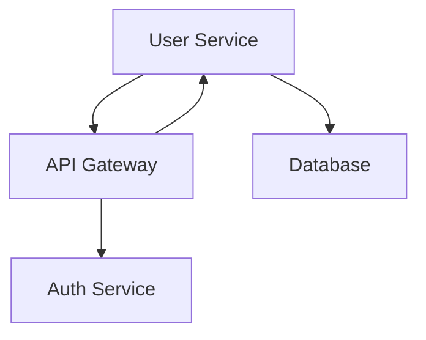

# 📚 Interactive Textbook Documentation

Learn how to generate structured, learning-oriented documentation that reads like a textbook with proper chapters, objectives, and educational flow.

---

## 🎯 What You'll Learn

- How to generate interactive textbook-style documentation
- Understanding the textbook structure and chapters
- Using learning paths for different user types
- Working with interactive elements and AI analysis
- Converting to multiple formats (HTML, Jupyter Notebooks)

---

## 📖 Overview

ScribeVerse's Interactive Textbook Documentation feature creates comprehensive, educational-style documentation that transforms your codebase into a structured learning experience. Instead of scattered documentation files, you get a coherent textbook with proper chapters, learning objectives, and progressive difficulty.

### ✨ Key Features

- **📋 Table of Contents** - Complete navigation with recommended learning paths
- **📖 Structured Chapters** - Logical progression from basics to advanced topics
- **🎯 Learning Objectives** - Clear goals for each chapter
- **💻 Interactive Examples** - Copy-paste ready code snippets with explanations
- **🤖 AI Analysis** - Intelligent insights and explanations throughout
- **🔗 Cross-References** - Smart linking between related concepts
- **📊 Live Statistics** - Real-time project metrics and analysis
- **📱 Multiple Formats** - HTML for browsers, .ipynb for Jupyter

---

## 🚀 Quick Start

### Basic Textbook Generation

The textbook feature is automatically included when you generate documentation:

```bash
# Generate complete documentation including textbook
scribeverse generate

# The textbook will be created in docs/notebooks/
```

### Textbook-Only Generation

If you want to focus only on the textbook format:

```bash
# Generate textbook documentation
scribeverse generate --format notebook

# Custom output directory for textbooks
scribeverse generate --format notebook --output ./learning-docs
```

---

## 📚 Textbook Structure

### Generated Files

When you run documentation generation, ScribeVerse creates a complete textbook in the `docs/notebooks/` directory:

```
docs/notebooks/
├── index.html                      # 📖 Textbook cover and navigation
├── 00-table-of-contents.html      # 📋 Complete chapter index
├── 01-introduction.html           # 🎯 Project overview and goals
├── 02-getting-started.html        # 🚀 Setup and installation guide
├── 03-architecture.html           # 🏗️ System design and patterns
├── 04-core-components.html        # ⚡ Main application modules
├── 05-services-and-apis.html      # 🌐 Service layer documentation
├── 06-data-and-models.html        # 🗄️ Data structures and models
├── 07-utilities-and-helpers.html  # 🔧 Helper functions and utilities
├── 08-api-reference.html          # 📚 Complete API documentation
├── 99-appendices.html             # 📖 Glossary and troubleshooting
└── [filename].ipynb               # 📓 Jupyter notebook versions
```

### Chapter Organization

ScribeVerse intelligently organizes your modules into logical chapters:

#### **Core Structure Chapters**
1. **📋 Table of Contents** - Navigation and learning paths
2. **📖 Introduction** - Project overview and objectives
3. **🚀 Getting Started** - Setup and basic usage
4. **🏗️ Architecture** - System design and patterns

#### **Module-Based Chapters**
ScribeVerse automatically categorizes your code into logical chapters:

- **⚡ Core Components** - Main application logic (`index.ts`, `app.ts`, `main.py`)
- **🌐 Services and APIs** - Service layer (`*Service.ts`, `*Controller.py`, `api/*`)
- **🗄️ Data and Models** - Data structures (`*Model.ts`, `schema/*`, `entities/*`)
- **🔧 Utilities and Helpers** - Helper functions (`utils/*`, `helpers/*`, `common/*`)
- **⚙️ Configuration** - Settings and configuration files

#### **Reference Chapters**
- **📚 API Reference** - Complete API documentation
- **📖 Appendices** - Glossary, troubleshooting, complete statistics

---

## 🎓 Learning Paths

The textbook includes customized reading paths for different types of users:

### 🟢 For Beginners (New to the project)
```
Recommended Path (2-3 hours):
1. Table of Contents (5 min) - Understand the structure
2. Introduction (15 min) - Learn what the project does
3. Getting Started (20 min) - Get up and running
4. Architecture (30 min) - Grasp the big picture
5. Core Components (45 min) - Understand main functionality
```

### 🟡 For Developers (Familiar with programming)
```
Recommended Path (1-2 hours):
1. Table of Contents (3 min) - Quick overview
2. Introduction (10 min) - Project context
3. Architecture (20 min) - System design deep dive
4. Core Components (30 min) - Key implementation details
5. API Reference (30 min) - Development reference
```

### 🔴 For Experts (Code reviewers, maintainers)
```
Recommended Path (1 hour):
1. Introduction (5 min) - Strategic overview
2. Architecture (15 min) - System design analysis
3. All Module Chapters (30 min) - Complete code review
4. API Reference + Appendices (10 min) - Reference materials
```

---

## 💡 Interactive Elements

### 📊 Live Statistics

Each chapter includes real-time project metrics:

```markdown
## 📊 Project at a Glance

| Aspect | Value | Notes |
|--------|-------|-------|
| Total Files | 45 | Source code files analyzed |
| Programming Languages | TypeScript, Python | Multi-language project |
| Functions | 127 | Callable functions and methods |
| Classes | 34 | Object-oriented classes |
| Code Elements | 289 | Total analyzable structures |
```

### 💻 Interactive Code Examples

Code examples with execution results and copy functionality:

```typescript
// Environment Check Script
console.log("🔍 Checking Development Environment...");

const nodeVersion = process.version;
console.log(`Node.js version: ${nodeVersion}`);

// Output:
// 🔍 Checking Development Environment...
// Node.js version: v18.17.0
// ✅ Environment check complete!
```

### 🤖 AI Analysis Cells

Special cells with AI-powered insights:

```markdown
## 🤖 AI Analysis

This project appears to be a web application built with TypeScript and Express.js.
The architecture follows a layered pattern with clear separation between:

- **Controllers**: Handle HTTP requests and responses
- **Services**: Implement business logic
- **Models**: Define data structures
- **Utilities**: Provide common functionality

*This analysis was generated by examining the codebase structure and patterns.*
```

---

## 🔧 Advanced Configuration

### Customizing Chapter Organization

You can influence how modules are organized by using descriptive file and folder names:

```bash
# These will be grouped in "Core Components"
src/
├── app.ts          # Main application
├── index.ts        # Entry point
└── core/
    ├── engine.ts   # Core functionality

# These will be grouped in "Services and APIs"
src/
├── services/
│   ├── UserService.ts
│   └── ApiService.ts
└── controllers/
    └── UserController.ts

# These will be grouped in "Data and Models"
src/
├── models/
│   ├── User.ts
│   └── Product.ts
└── schemas/
    └── database.sql
```

### Custom Learning Objectives

ScribeVerse automatically generates learning objectives, but you can enhance them by using JSDoc comments:

```typescript
/**
 * UserService handles all user-related operations.
 *
 * Learning objectives for this module:
 * - Understand user authentication flow
 * - Learn about data validation patterns
 * - Master error handling techniques
 *
 * @example
 * const service = new UserService();
 * const user = await service.createUser(userData);
 */
export class UserService {
    // Implementation...
}
```

---

## 📱 Multiple Formats

### HTML Format (Default)

Interactive HTML with embedded JavaScript:
- 🔍 **Navigation**: Click and navigate between chapters
- 💾 **Copy Code**: One-click code copying
- 📊 **Interactive Diagrams**: Zoomable Mermaid charts
- 📱 **Responsive**: Works on all devices

### Jupyter Notebook Format

Compatible `.ipynb` files for data scientists and researchers:
- 📓 **Jupyter Lab**: Open in Jupyter Lab/Notebook
- 🐍 **Python Integration**: Execute code cells if applicable
- 📊 **Data Analysis**: Use with pandas, matplotlib, etc.
- 🔗 **Version Control**: Track changes in git

### Accessing Different Formats

```bash
# View HTML version (default)
open docs/notebooks/index.html

# Open Jupyter notebooks
jupyter lab docs/notebooks/

# Or use specific notebook files
jupyter notebook docs/notebooks/01-introduction.ipynb
```

---

## 🎨 Customization Options

### Styling and Themes

The textbook supports custom styling:

```json
{
  "textbook": {
    "theme": "default",           // default, dark, academic
    "primaryColor": "#667eea",    // Main theme color
    "fontFamily": "system-ui",    // Typography
    "showLineNumbers": true,      // Code line numbers
    "enableCopyButtons": true,    // Copy code functionality
    "showProgressBar": true       // Reading progress
  }
}
```

### Content Customization

Control what gets included:

```json
{
  "textbook": {
    "includeSections": [
      "table-of-contents",
      "introduction",
      "getting-started",
      "architecture",
      "modules",
      "api-reference",
      "appendices"
    ],
    "excludeModules": ["test/**", "*.spec.ts"],
    "aiAnalysis": true,           // Include AI insights
    "interactiveExamples": true,  // Code execution examples
    "crossReferences": true,      // Auto-link related concepts
    "glossary": true              // Generate glossary
  }
}
```

---

## 🔗 Integration with Other Features

### Visual Diagrams

Textbook chapters automatically include relevant diagrams:

```markdown
## 🏗️ Architecture Diagram



**Interactive Version**: [View Zoomable Diagram](./diagrams/architecture.html)
```

### Cross-References

Smart linking between related concepts:

```markdown
## UserService

This service handles user management and works closely with:
- **Controllers**: [UserController](./05-services-and-apis.html#usercontroller)
- **Models**: [User Model](./06-data-and-models.html#user-model)
- **Utilities**: [Validators](./07-utilities-and-helpers.html#validators)
```

---

## 🎯 Best Practices

### 1. **Organize Your Code Structure**
Use descriptive file and folder names to help ScribeVerse categorize modules correctly:

```bash
# Good structure for textbook generation
src/
├── core/           # Will be "Core Components"
├── services/       # Will be "Services and APIs"
├── models/         # Will be "Data and Models"
├── utils/          # Will be "Utilities and Helpers"
└── config/         # Will be "Configuration"
```

### 2. **Add Descriptive Comments**
Use JSDoc or docstrings to provide context:

```typescript
/**
 * Handles user authentication and session management.
 * This is a critical security component that validates
 * user credentials and manages access tokens.
 */
export class AuthService {
    // Implementation...
}
```

### 3. **Include Examples in Code**
Add example usage in comments:

```python
def create_user(user_data: UserData) -> User:
    """
    Creates a new user account.

    Example:
        >>> service = UserService()
        >>> user = service.create_user({
        ...     "email": "john@example.com",
        ...     "name": "John Doe"
        ... })
        >>> print(user.id)
        "user_12345"
    """
```

### 4. **Use Consistent Naming**
Follow naming conventions for better categorization:
- `*Service.ts` → Services and APIs chapter
- `*Model.ts` → Data and Models chapter
- `*Controller.ts` → Services and APIs chapter
- `*Utils.ts` → Utilities and Helpers chapter

---

## 🚀 Real-World Example

Let's look at how a typical project gets transformed into a textbook:

### Project Structure
```
my-app/
├── src/
│   ├── app.ts              # Main application
│   ├── server.ts           # Server setup
│   ├── controllers/
│   │   ├── UserController.ts
│   │   └── ProductController.ts
│   ├── services/
│   │   ├── UserService.ts
│   │   └── EmailService.ts
│   ├── models/
│   │   ├── User.ts
│   │   └── Product.ts
│   └── utils/
│       ├── validation.ts
│       └── helpers.ts
```

### Generated Textbook
```
docs/notebooks/
├── index.html                      # Learning guide and navigation
├── 00-table-of-contents.html      # Complete chapter overview
├── 01-introduction.html           # Project overview and purpose
├── 02-getting-started.html        # Setup Node.js, install dependencies
├── 03-architecture.html           # MVC architecture analysis
├── 04-core-components.html        # app.ts, server.ts deep dive
├── 05-services-and-apis.html      # Controllers and Services
├── 06-data-and-models.html        # User and Product models
├── 07-utilities-and-helpers.html  # Validation and helper functions
├── 08-api-reference.html          # Complete API documentation
└── 99-appendices.html             # Troubleshooting and glossary
```

Each chapter includes:
- **Learning objectives** for that module group
- **Code examples** with explanations
- **AI analysis** of the code patterns
- **Cross-references** to related chapters
- **Interactive elements** for hands-on learning

---

## 🛠️ Troubleshooting

### Common Issues

**Issue**: Textbook chapters seem disorganized
**Solution**: Use descriptive file and folder names that clearly indicate purpose

**Issue**: Missing cross-references
**Solution**: Ensure modules have clear dependencies and imports

**Issue**: AI analysis not appearing
**Solution**: Check that your AI provider is configured and has sufficient token limits

**Issue**: Jupyter notebooks not opening
**Solution**: Ensure Jupyter is installed: `pip install jupyter`

### Getting Help

- **📋 Check the examples** in this guide
- **🔍 Review your project structure** for logical organization
- **🤖 Verify AI provider configuration** for enhanced analysis
- **📞 Open an issue** if you encounter bugs

---

## 📚 Related Guides

- **[Provider Configuration](./providers.md)** - Set up AI providers for enhanced analysis
- **[Visual Diagrams](./diagrams.md)** - Add interactive diagrams to chapters
- **[Multi-Language Support](./multi-language.md)** - Document multiple programming languages
- **[CI/CD Integration](./cicd.md)** - Automate textbook generation in your pipeline

---

**🎓 Happy Learning!** The Interactive Textbook Documentation transforms your codebase into a comprehensive learning resource that helps new team members, developers, and stakeholders understand your project quickly and effectively.